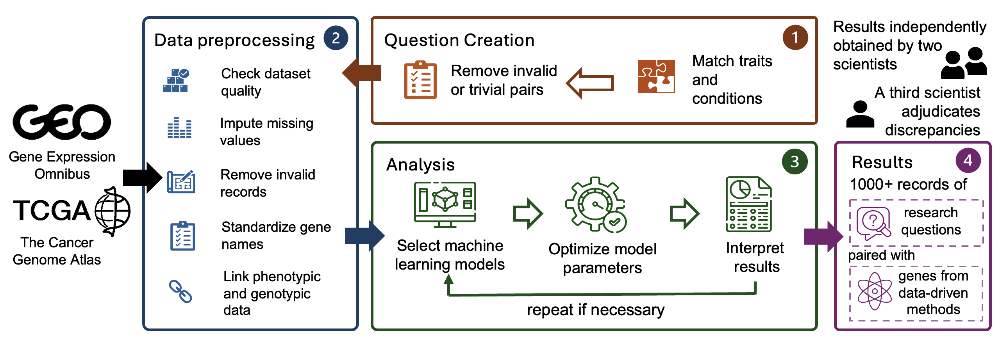

# GenoTEX: A Benchmark for Automated Gene Expression Data Analysis

<div align="center">
  
  <br>
  <br>
  <a href="https://creativecommons.org/licenses/by/4.0/">
    
  </a>
  
  
  
</div>

GenoTEX (**Geno**mics Data Au**t**omatic **Ex**ploration Benchmark) is a benchmark dataset for the automated analysis of gene expression data to identify disease-associated genes while considering the influence of other biological factors. It provides annotated code and results for solving a wide range of gene identification problems, encompassing dataset selection, preprocessing, and statistical analysis, in a pipeline that follows computational genomics standards. The benchmark includes expert-curated annotations from bioinformaticians to ensure accuracy and reliability.

The below figure illustrates our benchmark curation process. For detailed information, please refer to our [paper on arXiv](https://arxiv.org/abs/2406.15341).

<div align="center">
  
</div>

## Table of Contents

- [Dataset Overview](#dataset-overview)
- [Dataset Structure](#dataset-structure)
- [Getting Started](#getting-started)
- [Usage](#usage)
- [Citation](#citation)
- [License](#license)

## 📊 Dataset Overview

GenoTEX provides a benchmark for evaluating automated methods for gene expression data analysis, particularly for LLM-based agents. In biomedical research, gene expression analysis is crucial for understanding biological mechanisms and advancing clinical applications such as disease marker identification and personalized medicine. However, these analyses are often repetitive, labor-intensive, and prone to errors, leading to significant time and financial burdens on research teams.

Key features of the benchmark include:

- **1,384 gene identification problems**: 132 unconditional problems and 1,252 conditional problems
- **41.5 GB of input data**: 911 datasets with an average of 167 samples per dataset (152,415 total samples)
- **237,907 lines of analysis code**: Carefully curated by bioinformatics experts (average 261 lines per dataset)
- **Three evaluation tasks**: Dataset selection, data preprocessing, and statistical analysis
- **Comprehensive gene features**: Average of 18,530 normalized gene features per dataset
- **Significant gene discoveries**: Significant genes identified per problem

Each problem in the benchmark involves identifying genes associated with a specific trait (e.g., a disease) while optionally considering the influence of some condition (e.g., age, gender, or a co-existing trait). This approach mimics real-life research scenarios where key genes linked to traits often vary based on the diverse physical conditions of patients.

## 🗂️ Dataset Structure

The complete dataset consists of code hosted directly in this repository and data accessible through cloud storage. This structure allows for efficient access to the analysis methods while keeping the large data files separate.

### Data (Download Required)

The data part is accessible through:
- [Google Drive Link](https://drive.google.com/drive/folders/1ZQ8AflAecW61SrNclaMby-6x9GLCpJoW)
- [Baidu Cloud Disk Link](https://pan.baidu.com/s/1mKfBRiBNY0GUK6LRLnn7UA?pwd=1234)

Total data size: 82.0 GB — Please ensure you have sufficient disk space before downloading.

Download these files and place them in the root directory of this repository.

The data is organized into three main directories:

```
./
├── input/               # Raw input data from public databases
│   ├── GEO/             # Data from Gene Expression Omnibus
│   │   ├── Trait_1/
│   │   │   ├── GSE12345/
│   │   │   │   ├── GSE12345_family.soft.gz
│   │   │   │   └── GSE12345_series_matrix.txt.gz
│   │   │   └── ...
│   │   └── ...
│   └── TCGA/            # Data from The Cancer Genome Atlas
│       ├── TCGA_Cancer_Type_1/
│       │   ├── TCGA.XXXX.sampleMap_XXXX_clinicalMatrix
│       │   └── TCGA.XXXX.sampleMap_HiSeqV2_PANCAN.gz
│       └── ...
│
├── output/              # Analysis output data
│   ├── preprocess/      # Preprocessed datasets
│   │   ├── Trait_1/
│   │   │   ├── clinical_data/
│   │   │   │   ├── GSE12345.csv
│   │   │   │   ├── Xena.csv
│   │   │   │   └── ...
│   │   │   ├── gene_data/
│   │   │   │   ├── GSE12345.csv
│   │   │   │   ├── Xena.csv
│   │   │   │   └── ...
│   │   │   ├── cohort_info.json
│   │   │   ├── GSE12345.csv
│   │   │   ├── Xena.csv
│   │   │   └── ...
│   │   └── ...
│   └── regress/         # Regression analysis results
│       ├── Trait_1/
│       │   ├── significant_genes_condition_None.json
│       │   ├── significant_genes_condition_Condition_1.json
│       │   └── ...
│       └── ...
│
└── metadata/            # Problem specifications and domain knowledge
    ├── task_info.json   # Gene identification problems; known gene-trait associations
    └── gene_synonym.json # Gene symbol mapping
```

#### Notes on Data Organization:

1. **Trait Name Normalization**: To make path operations safer, trait names are normalized by removing apostrophes (') and replacing spaces with underscores (_). For example, "Crohn's Disease" becomes "Crohns_Disease", and "Large B-cell Lymphoma" becomes "Large_B-cell_Lymphoma". This consistent formatting helps prevent path-related errors when working with the dataset.

2. **Input Data Structure**:
   
   - **GEO folder**: Organized by our predefined trait names. Each trait directory holds 1-11 cohort datasets related to this trait, which were programmatically searched under specific criteria and downloaded from the GEO database using Entrez Utilities. Each cohort dataset is stored as a folder named after the GEO Series (GSE) number, such as 'GSE98578'. Each cohort folder contains `.gz` files, typically one SOFT file and one matrix file, though occasionally there are multiple SOFT files or matrix files.

   - **TCGA folder**: Directly downloaded from the TCGA Hub of the UCSC Xena platform, organized by different types of cancer. We preserve the original folder names from the website, without strictly matching our predefined trait names. Each trait (cancer) folder contains a clinicalMatrix file storing sample clinical features, and a PANCAN.gz file storing gene expression data.

3. **Preprocessed Data Structure**:
   
   The 'preprocess' folder is organized by predefined trait names. For each trait, it holds the clinical data, gene expression data, and the final linked data that are successfully preprocessed for each cohort into 3 separate CSV files. These CSV files are saved in '{trait_name}/clinical_data/', '{trait_name}/gene_data/', and '{trait_name}/' respectively, with the same filename '{cohort_ID}.csv'. 
   
   For GEO cohorts, the cohort ID is the Series number (GSE); for TCGA, since there is at most one TCGA cohort related to each trait, we directly use 'Xena' as the cohort ID.
   
   The `cohort_info.json` stores metadata about the preprocessing outcomes of each cohort related to the trait with the following fields:
   
   - `is_gene_available` and `is_trait_available`: Indicate whether the dataset has the relevant gene expression and trait information, respectively. `is_available` is true if both are available.
   - `is_biased`: Indicates whether the trait distribution is severely biased. For example, if a dataset about breast cancer treatment only contains positive samples, it would be considered biased and not usable for trait-gene association studies.
   - `is_usable`: True if `is_available` is true and `is_biased` is false.
   - `has_age` and `has_gender`: Indicate whether the dataset contains the samples' age and gender information, respectively.
   - `sample_size`: Records the number of samples in the final linked dataset, after discarding samples with too many missing features.

4. **Regression Results Structure**:
   
   The 'regress' folder is also organized by predefined trait names. It holds the regression analysis outputs for all gene identification problems in our benchmark that involve the same trait. These problems are uniquely identified by a trait-condition pair.
   
   The analysis output for each problem is stored in a file named "significant_genes_condition_{condition name}.json", where the condition name is either a predefined trait name, or 'Age', 'Gender', or 'None'. A 'None' condition represents an unconditional problem: "What are the significant genes related to this trait," without considering the influence of any conditions.
   
   Each JSON file contains:
   
   - `significant_genes`: A dictionary with three keys:
     - `Variable`: List of gene symbols identified as significant
     - `Coefficient`: The corresponding coefficients in the trained regression model
     - `Absolute Coefficient`: The absolute values of these coefficients
   
   The gene symbols are ranked by importance (absolute coefficient in Lasso models). The `cv_performance` part is used mainly for model validation and diagnostics, not part of our benchmark evaluation.

5. **Metadata Structure**:
   
   - `task_info.json`: Contains full specifications for the gene identification problems in our benchmark, and domain knowledge about gene-trait associations. For each trait, it includes:
     - `related_genes`: A list of genes known to be associated with the trait, sourced from the Open Targets Platform
     - `conditions`: The list of conditions paired with the trait to form gene identification problems in our benchmark
   
   - `gene_synonym.json`: Stores the mapping from common acronyms of human gene symbols to their standard symbols, sourced from the NCBI Gene databases. This is useful for normalizing gene symbols during preprocessing to prevent inaccuracies arising from different gene naming conventions.

### Code (In This Repository)

```
./
├── code/                # Analysis code
│   ├── Trait_1/
│   │   ├── GSE12345.ipynb
│   │   ├── Xena.ipynb
│   │   └── ...
│   ├── ...
│   └── regress.py       # Regression analysis implementation
│
├── tools/               # Function tools for gene expression data analysis
├── utils/               # Helper functions for experimentation and evaluation
├── download/            # Scripts for downloading datasets
├── datasheet.md         # Datasheets for Datasets documentation
├── metadata.json        # Croissant metadata in JSON-LD format
└── requirements.txt     # Package dependencies
```

The code part of the benchmark includes:

- **code/**: Contains our code for gene expression data analysis. The main part is the code for preprocessing each cohort dataset, organized by predefined trait names. We provide the code as Jupyter Notebook files with the name '{cohort_ID}.ipynb', showing the output of each step to facilitate interactive analysis. `regress.py` implements our regression analysis method in fixed logic, for solving the gene identification problems in our benchmark.

- **tools/**: Contains the function tools that are accessible to both human bioinformaticians and LLM agents for gene expression data analysis.

- **utils/**: Contains the helper functions used for this project outside of the data analysis tasks, e.g., experiment logging, evaluation metrics, etc.

- **download/**: Contains the scripts for programmatically searching and downloading input gene expression datasets, and acquiring domain knowledge files from public repositories. It also includes the script for selecting important trait-condition pairs to form our gene identification problems.

- **Documentation files**: `datasheet.md` provides the Datasheets for Datasets documentation of our benchmark, and `metadata.json` provides the Croissant metadata in JSON-LD format.

## 🚀 Getting Started

### Installation

1. Clone this repository:
   ```bash
   git clone https://github.com/Liu-Hy/GenoTEX.git
   cd GenoTEX
   ```

2. Download the data folders ('metadata', 'input', 'output') from the provided cloud storage links and place them in the root directory of this repository.

3. Create and activate a conda environment:
   ```bash
   conda create -n genotex python=3.10
   conda activate genotex
   pip install -r requirements.txt
   ```

## 💻 Usage

### Exploring the Benchmark

You can run the Python code in the "./code/" directory to explore the data analysis process. These files implement the data analysis following our standardized pipeline, which involves:

1. **Dataset filtering**: Filtering out datasets irrelevant to our association studies
2. **Gene expression data preprocessing**: Preparing a gene expression data table with normalized gene symbols
3. **Trait data extraction**: Preparing a data table with phenotypic trait and demographic information
4. **Data linking**: Integrating gene and trait data for the same samples
5. **Dataset selection and statistical analysis**: Selecting the best dataset for the problem, and identifying significant genes through regression analysis

### Evaluating Your Own Methods

After developing your automated method for gene expression data analysis, you can evaluate it against our benchmark:

1. Make sure your method produces output following the same format as our benchmark.
2. Run the evaluation script:
   ```bash
   python eval.py -p {prediction_directory} -r {output}
   ```

The script will evaluate your method on the three tasks defined in our benchmark:

- **Dataset selection and filtering**: Evaluates the ability to identify useful datasets and select the optimal ones for analysis
- **Preprocessing**: Measures how well the method processes and integrates data from different sources
- **Statistical analysis**: Assesses the accuracy of identifying significant genes related to traits

The script will detect non-conformance in format, but you will need to correct any formatting issues detected to ensure accurate evaluation.

## 📝 Citation

If you use GenoTEX in your research, please cite our paper:

```bibtex
@misc{liu2025genotexbenchmarkautomatedgene,
      title={GenoTEX: A Benchmark for Automated Gene Expression Data Analysis in Alignment with Bioinformaticians}, 
      author={Haoyang Liu and Shuyu Chen and Ye Zhang and Haohan Wang},
      year={2025},
      eprint={2406.15341},
      archivePrefix={arXiv},
      primaryClass={cs.LG},
      url={https://arxiv.org/abs/2406.15341}, 
}
```

## ⚖️ License

The GenoTEX dataset is released under a Creative Commons Attribution 4.0 International (CC BY 4.0) license, which allows for broad usage while protecting the rights of the creators. The authors bear full responsibility for ensuring that the dataset adheres to this license and for any potential violations of rights. For the full license text, please see the [LICENSE.md](./LICENSE.md) file in this repository.
